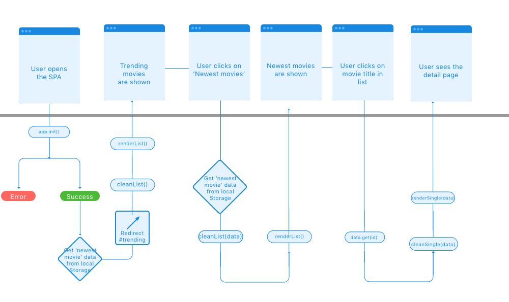

# MovieSpot
MovieSpot is a Single Page movie database. It's possible to check out the latest-, upcoming-, top rated-, trending movies & much more. Want more movies like youre favorite movie? Just search for the movie & see what movies are similar to that one.

## Features

- Get a list of the most popular movies, the latest movies, upcoming movies and trending movies.
- Get detailled information about every movie, including a short overview, poster image, budget & revenue, language and a lot more.
- Get a list of similar movies for each movie on MovieSpot.
- Search for movies in the Movie Database, and get direct results.
- Unlimited random movies, just push the menu-item and get a new random movie everytime.

## Usage

- Open the [application](http://camille-sebastien.com/moviespot) and you'll see the movies that are actually trending.
- Click on the menu items to see other lists (like, upcoming & newest movies). The list now automatically adapts to your choice.
- Want to search for a movie? Click on the magnifiying glass to open the search form.
- Want to see a random movie? Click on the 'random' button in the menu!
- Want to see similar movies? Click on an movie and get a list of similar ones!

## Flow diagram

## SPA Diagram

## Wishlist
- Search movies based on genres
- Rate movies from this SPA -> Post to themoviedb
- Include trailers from other API
- Include more filter options

## Sources
- https://github.com/leonidas/transparency
- http://projects.jga.me/routie/
- http://stackoverflow.com/questions/149055/how-can-i-format-numbers-as-money-in-javascript
- http://stackoverflow.com/questions/413439/how-to-dynamically-change-a-web-pages-title
- http://stackoverflow.com/questions/42386509/object-properties-are-undefined-the-object-itself-shows-all-the-data-though
- https://www.themoviedb.org/
- https://developers.themoviedb.org/3
- https://www.gosquared.com/resources/flag-icons/
